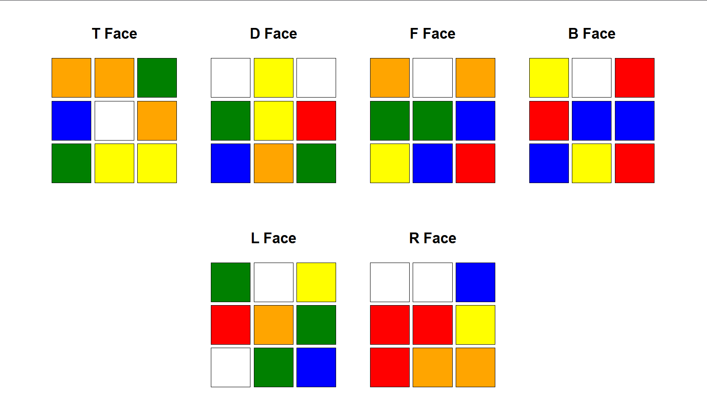

# 🧊 Rubik's Cube Simulator & Solver (3x3) – JavaScript

A fully functional **Rubik’s Cube (3x3)** simulator built using **vanilla JavaScript**. Includes scrambling, face rotation, and a white cross solver. Designed to demonstrate logical thinking, matrix manipulation, and DSA-style problem solving.

## 📸 Output Screenshot
    



## 🚀 Features

- ✅ Rotate any face (`F`, `B`, `L`, `R`, `T`, `D`) **clockwise**.
- 🔄 Automatically **scramble** the cube with random moves.
- 🧠 One-click solution for creating the **White Cross**.
- 🖨️ Console-based **cube display** after each action.
- 🧩 Clean modular code for easy expansion (solver, UI, etc.).


## 📦 Cube Representation

Each face is a 3x3 matrix stored inside an object:
```js
this.faces = {
  T: [...],  // Top    - White (W)
  D: [...],  // Down   - Yellow (Y)
  F: [...],  // Front  - Green (G)
  B: [...],  // Back   - Blue (B)
  L: [...],  // Left   - Orange (O)
  R: [...]   // Right  - Red (R)
}
